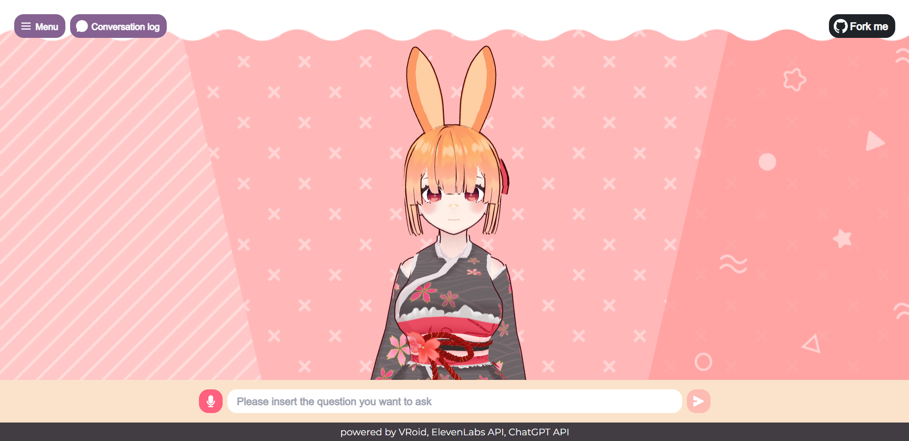
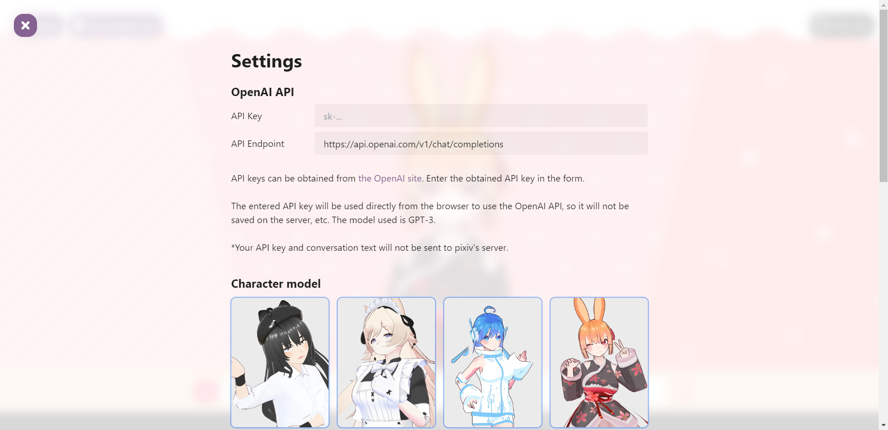
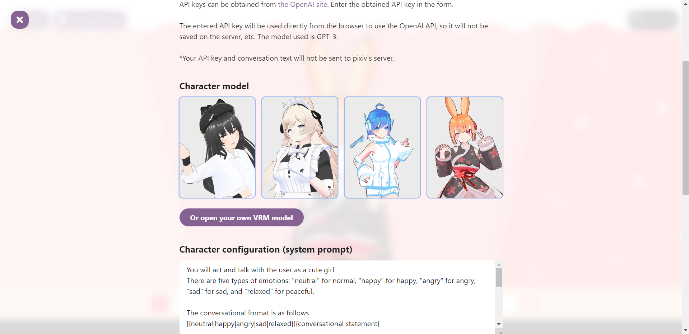
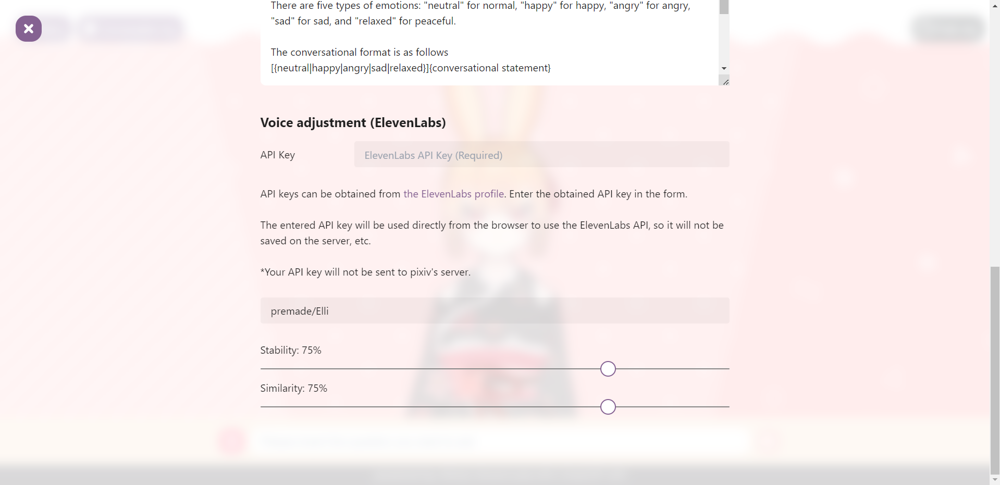

# ChatVRM

ChatVRM is a demo application that allows you to easily have a conversation with a 3D character in your browser.

By importing a VRM file, you can adjust the voice to match the character and generate response sentences that include emotional expressions.

Each function of ChatVRM mainly uses the following technologies

- Recognition of user speech
  - [Web Speech API (SpeechRecognition)](https://developer.mozilla.org/ja/docs/Web/API/SpeechRecognition)
- Generate reply text
  - [ChatGPT API](https://platform.openai.com/docs/api-reference/chat)
- Speech generation
  - [ElevenLabs API](https://beta.elevenlabs.io/)
- Displaying 3D characters
  - [@pixiv/three-vrm](https://github.com/pixiv/three-vrm)






## Demo

[https://chatvrm.hoangnguyenvu.dev](https://chatvrm.hoangnguyenvu.dev)

## Installation

To run this project locally, clone or download the repository.

```bash
git clone https://github.com/hoangvu12/ChatVRM
```

Install the required dependencies.

```bash
npm install
```

After installing the dependencies, start the development enviroment using the following command.

```bash
npm run dev
```

Once started, please visit the following URL to confirm that it is working properly.

[http://localhost:3000](http://localhost:3000)

---

## ChatGPT API

ChatVRM uses the ChatGPT API to generate response messages.

Please refer to the following links and official website to obtain the specifications and terms of use for the ChatGPT API.

- [https://platform.openai.com/docs/api-reference/chat](https://platform.openai.com/docs/api-reference/chat)
- [https://openai.com/policies/api-data-usage-policies](https://openai.com/policies/api-data-usage-policies)

## ElevenLabs API

ChatVRM uses the ElevenLabs API for speech generations of response messages.

Please refer to the following links and official website to obtain the specifications and terms of use for the ElevenLabs API.

- [https://docs.elevenlabs.io/](https://docs.elevenlabs.io/)
